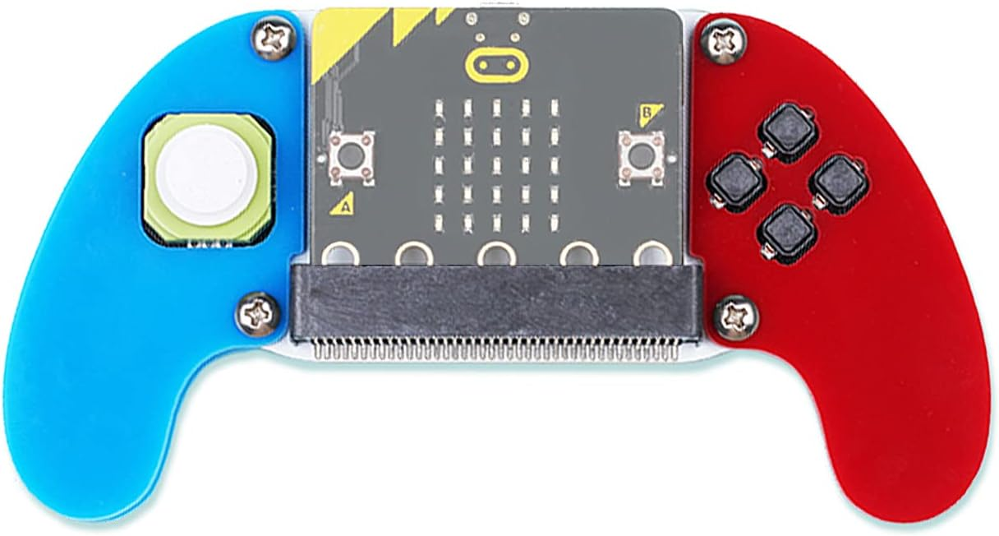

# Rust BLE Embedded Gamepad

## Overview

Demo of bringing up Bluetooth Low Energy (BLE) using Embedded Rust, by turning a BBC Microbit ([nordic NRF52833](https://www.nordicsemi.com/products/nrf52833)) into a wireless game controller.

## Prerequisites

- [BBC micro:bit v2](https://microbit.org/)
- [Gamepad Adapter](https://www.amazon.co.uk/ELECFREAKS-microbit-Joystick-Wireless-Control/dp/B09Q17XZ1N/)



## Setup

```bash
cargo install cargo-binstall # binary installer tool
cargo binstall probe-rs-tools
cargo binstall flip-link
```

```bash
cargo run --release
```

## Troubleshooting

`nrf-sdc` requires clang. On Windows I install this with `choco install llvm`. Once installed, you need to set the LIBCLANG_PATH environment variable to the directory containing libclang.dll.

- Open the Start Menu, search for "Environment Variables," and select "Edit the system environment variables."
- Click on "Environment Variables."
- Under "System variables," click "New" and set:
- Variable name: LIBCLANG_PATH
- Variable value: The full path to the folder containing libclang.dll (e.g., C:\Program Files\LLVM\bin).
- Click "OK" to save the changes.
